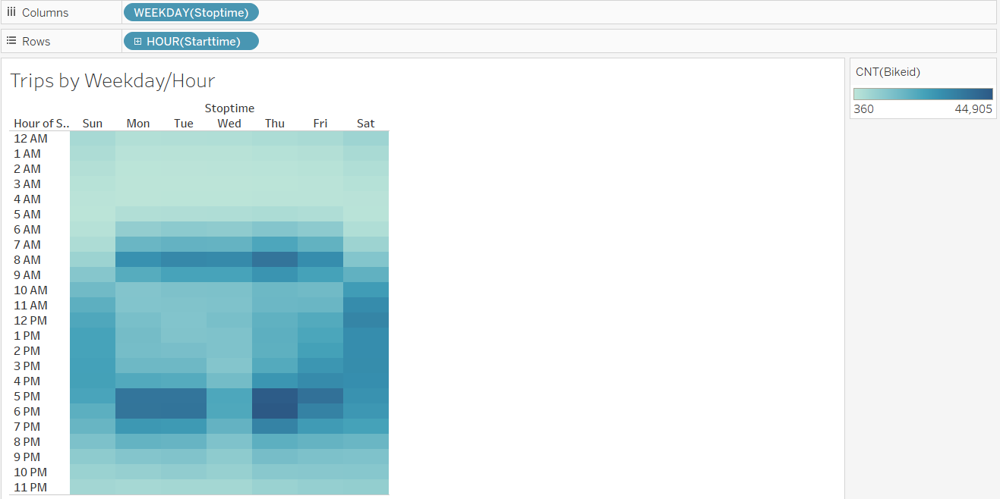
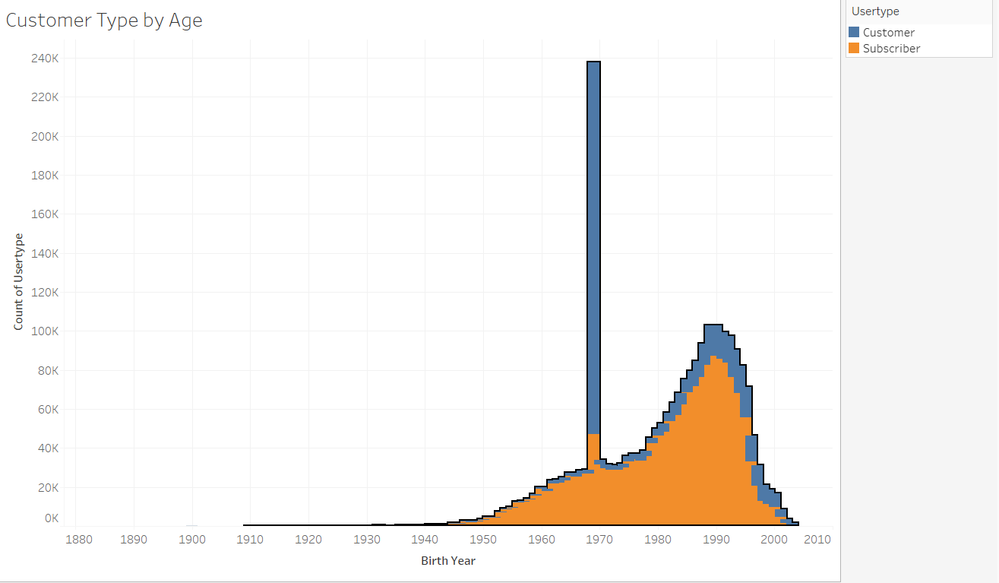
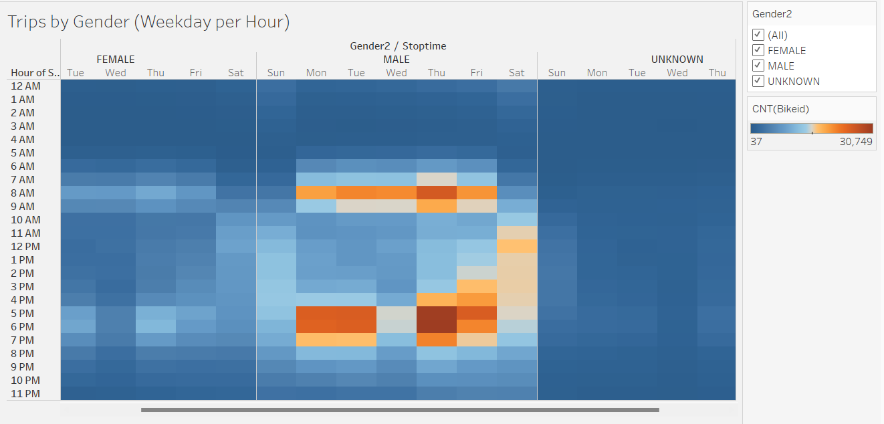

# week_14_NYC_Citi_Bike

# Overview of the statistical analysis:
The purpose of this analysis is to complete comparisons of Citi Bike rides to convince investors that a bike-sharing program in Des Moines is a solid business proposal. 

# Results:
Reviewing the available data shows that there are correlation between time, age and gender for bike rides in this area. The below image shows the trips by the weekday per hour with majority of the trips being completed during the respective rush hours and weekends.  

Not only are majority of trips dependent on the timing of day and which week day is it, the gender and age also play an important role. 

The image below displays that most users are born in 1969 while subscribers are born in 1990. 

Trips are mainly completed by males throughout the week with majority of the trip occuring during rush hours. 

More tables to review these correlations can be found at the following link: 
[link to dashboard](LINK GOES HERE "https://public.tableau.com/app/profile/choua.vang1594/viz/BikeRidingData/NYCCitiBikeAnalysis")

# Summary:
There is a correlation between timing, age, and gender for bike trips. There are more male bike riders than there are females. majority of the bike riding occurs during rush hours and weekends. For an effective proposal for a Des Moines program, additional information is required. Demographics for Des Moines would be required to compare to this current data to provide more support. Des Moines' age population, gender and weather would be able to provide supporting data for a bike ride sharing program in Des Moines. 